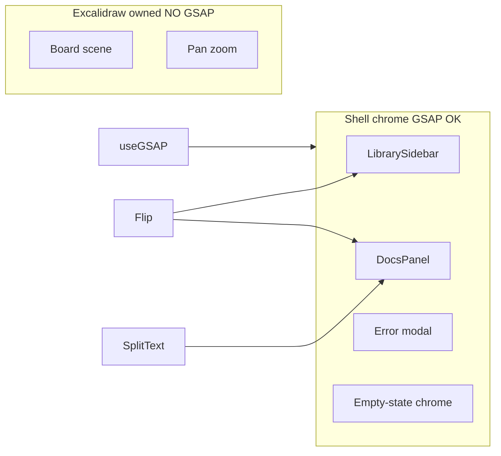

# Architecture delta — v1.2 shell GSAP

Baseline: [mindmap-v1.1/specs/architecture-delta.md](../../mindmap-v1.1/specs/architecture-delta.md) and [mindmap-v1/specs/architecture.md](../../mindmap-v1/specs/architecture.md). Delta only.

## Unchanged

- Electron main + preload + renderer; CSP; sandbox; contextIsolation
- `.lkmindmap` schema; boards folder; IPC surface from v1.1
- Excalidraw owns scene graph, pan/zoom, strokes — **no GSAP there**

## Delta — motion stack

```text
src/motion/          # shared reduced-motion gate, defaults, plugin register
LibrarySidebar       # enter/exit + Flip (shell)
DocsPanel            # enter/exit + Flip + SplitText (shell)
App.tsx              # error modal + optional empty-canvas chrome tweens
```

Dependencies: `gsap`, `@gsap/react`. Plugins in: **Flip**, **SplitText**. Plugins out: ScrollTrigger, ScrollSmoother, Draggable, MorphSVG/DrawSVG, Inertia, ScrambleText.

## Walls diagram



## Cleanup

All GSAP work via `useGSAP` contexts (or equivalent) so React unmount reverts splits/tweens. No dangling SplitText DOM.

## Non-goals

Account, collab, auto-layout, signing, remote help, tip writes, gear Active, canvas GSAP.
